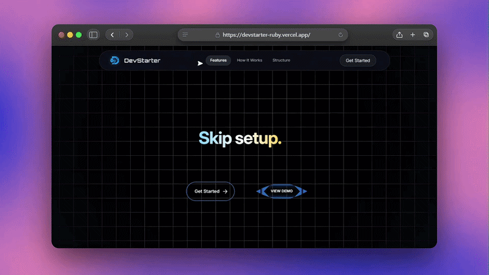

<div align="center">


# DevStarter

**Generate modern project boilerplates with clean architecture and developer tooling built in.**

A multi-stack boilerplate generator with configurable tooling, AI-assisted documentation, and production-ready architecture.

<br />

[](https://react.dev)
[](https://nodejs.org)
[](https://tailwindcss.com)
[](https://vite.dev)

<br />

[Demo](#demo) · [Features](#features) · [Stacks](#supported-stacks) · [Get Started](#getting-started)

</div>

---

## Demo

<div align="center">
  <a href="https://youtu.be/JXqDxq8BeAE" target="_blank">
    
  </a>
  <br />
  <sub>Click the preview to watch the full walkthrough on YouTube</sub>
</div>

---

## What is DevStarter?

DevStarter is a multi-stack boilerplate generator built for developers who'd rather write application code than spend hours wiring up auth, Docker, linting, and deployment configs from scratch.

Pick a stack, select the features you need, and download a ready-to-run project as a ZIP — with clean architecture, sensible defaults, and an AI-generated README tailored to your setup.

---

## Features

**Multi-Stack Scaffolding** — Generate boilerplates across 8 production stacks from a single interface. Each template follows the conventions and best practices of its ecosystem.

**Authentication** — Pre-configured auth flows including registration, login, and protected routes, wired into your chosen stack's idioms.

**Docker Setup** — Production-ready `Dockerfile` and `docker-compose.yml` included so your project is container-ready from minute one.

**Deployment Configs** — Ship faster with pre-built deployment configurations tailored to popular hosting platforms.

**Environment Variables** — Structured `.env` files with sensible defaults and clear documentation, so nothing gets lost between local and production.

**Tailwind CSS** — Integrated Tailwind setup with proper configuration, ready for you to start building UI immediately.

**AI-Assisted README Generation** — Automatically generate professional, stack-aware documentation tailored to your selected architecture and features.

**One-Click GitHub Repository Creation** — Securely create and initialize repositories directly in your GitHub account with your generated project structure ready to push and manage.

**Linting & Formatting** — ESLint and Prettier configurations pre-wired to enforce consistent code style from the first commit.

**GitHub Integration** — Automatically initialize repositories with clean project structure, proper git configuration, and seamless version control workflow.

---

## Supported Stacks

| Stack | Type | Status |
|:------|:-----|:------:|
| **MERN** | Full-Stack | ✅ Supported |
| **Next.js** | Full-Stack | ✅ Supported |
| **Node.js + Express** | Backend | ✅ Supported |
| **Django** | Backend | ✅ Supported |
| **Spring Boot** | Backend | ✅ Supported |
| **Flask** | Backend | ✅ Supported |
| **Full-Stack TypeScript** | Full-Stack | ✅ Supported |
| **React Native** | Mobile | ✅ Supported |

---

## How It Works

```
Select Stack  →  Configure  →  Generate  →  Ship
```

1. **Select your preferred stack** — Choose from 8 production-tested technology stacks.
2. **Configure features and tooling** — Enable authentication, Docker, Tailwind, deployment configs, linting, and more.
3. **Generate a production-ready boilerplate** — DevStarter assembles a structured, opinionated project with your selections baked in.
4. **Download or push to GitHub** — Export as a ZIP or create a repository directly in your GitHub account.
5. **Start building** — Hit the ground running with clean architecture and pre-configured tooling.

---

## Getting Started

### Prerequisites

- **Node.js** ≥ 18
- **npm** ≥ 9

### Installation

**1. Clone the repository**

```bash
git clone https://github.com/Debug-Aryan/DevStarter.git
cd DevStarter
```

**2. Install server dependencies**

```bash
cd server
npm install
```

**3. Install client dependencies**

```bash
cd ../client
npm install
```

**4. Configure environment variables**

Create `.env` files in both `server/` and `client/` directories. See [Environment Variables](#environment-variables) below.

**5. Start development servers**

```bash
# Terminal 1 — Server
cd server
npm run dev

# Terminal 2 — Client
cd client
npm run dev
```

The client runs on `http://localhost:5173` and the server on `http://localhost:3000` by default.

---

## Environment Variables

### Server (`server/.env`)

```env
PORT=3000
LLM_API_KEY=your_api_key
GITHUB_CLIENT_ID=your_github_client_id
GITHUB_CLIENT_SECRET=your_github_client_secret
CLIENT_APP_URL=http://localhost:5173
```

### Client (`client/.env`)

```env
VITE_API_URL=http://localhost:3000
```

---

## Project Structure

```
DevStarter/
├── client/                  # React + Vite frontend
│   ├── src/
│   │   ├── components/      # Shared UI components
│   │   ├── context/         # React context providers
│   │   ├── data/            # Static data & configuration
│   │   ├── features/        # Feature-specific modules
│   │   ├── pages/           # Route-level page components
│   │   ├── routes/          # Route definitions
│   │   ├── services/        # API service layer
│   │   └── utils/           # Utility functions
│   ├── vite.config.js
│   └── package.json
│
├── server/                  # Node.js + Express backend
│   ├── controllers/         # Request handlers
│   ├── generators/          # Boilerplate generation logic
│   ├── routes/              # API route definitions
│   ├── services/            # External API integrations
│   ├── templates/           # Stack-specific templates
│   │   ├── mern/
│   │   ├── nextjs/
│   │   ├── node-express/
│   │   ├── django/
│   │   ├── spring-boot/
│   │   ├── flask/
│   │   ├── full-stack-ts/
│   │   └── react-native/
│   ├── utils/               # Server utilities
│   ├── server.js
│   └── package.json
│
└── assets/                  # Logo, demo GIF
```

---

## Tech Stack

| Layer | Technologies |
|:------|:-------------|
| **Frontend** | React 19, Vite, Tailwind CSS, React Router, Framer Motion |
| **Backend** | Node.js, Express 5 |
| **Automation & Integrations** | JSZip, FileSaver, OpenRouter API, GitHub API |
| **Build & Bundle** | Vite, Archiver (ZIP generation) |

---

<div align="center">

Built and maintained by **[Aryan Prajapati](https://github.com/Debug-Aryan)**

If DevStarter saved you time, consider giving it a ⭐

</div>
